# 💉 COVID-19 Data Exploration 

Let's explore a global COVID-19 [data set](https://ourworldindata.org/covid-deaths) (the data used for this project goes up to 4/30/21).

View the complete syntax [here](https://github.com/rb118/PortfolioProject/blob/main/COVID_Project/Covid_Portfolio_SQL_Final.sql).

View the Tableau visualizations [here](https://public.tableau.com/app/profile/richard.b5125) (there is a dashboard with updated information as of 2023 visualizing global vaccinations).

***

### 1. What are the total cases, total deaths, and the amount of deaths per case in the United States?

``` sql
SELECT location, date, total_cases, total_deaths, (total_deaths)/(total_cases)*100 AS DeathPercentage
FROM PortfolioProject..CovidDeaths
WHERE location = 'United States'
ORDER BY 1, 2
```

Result: 465 rows

Here are the last few rows:

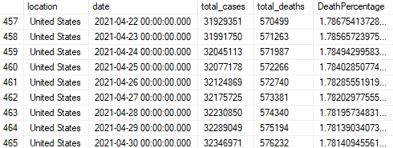

***

### 2. What are each location's highest amount of confirmed cases (max amount of people infected) and the percent of the popuation infected?

``` sql 
SELECT location, population, MAX(total_cases) AS HighestInfectionCount, MAX((total_cases/population))*100 AS PercentPopulationInfected
FROM PortfolioProject..CovidDeaths
GROUP BY location, population
ORDER BY 1, 2
```

Result: 219 rows

Here are the first 9 rows:

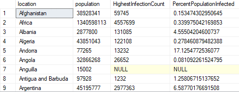

***

### 3. What is the max total death count for each location?

``` sql
SELECT location, MAX(CAST(total_deaths AS int)) AS TotalDeathCount
FROM PortfolioProject..CovidDeaths
WHERE continent IS NOT NULL
GROUP BY location
ORDER BY TotalDeathCount DESC
```

Result: 210 rows

Here are the first 9 rows:

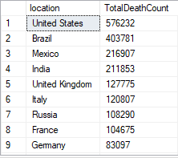

***

### 4. What are the countries where the highest death count is greater than or equal to 50,000?

``` sql
with cte AS(
SELECT location, MAX(CAST(total_deaths AS int)) AS TotalDeathCount
FROM PortfolioProject..CovidDeaths
WHERE continent IS NOT NULL 
GROUP BY location
)
SELECT location, TotalDeathCount
FROM cte
WHERE TotalDeathCount >= 50000
ORDER BY TotalDeathCount DESC
```

Result: 210 rows

Here are the last few rows where the result is not null (notice TotalDeathCount does not go below 50,000):

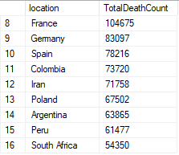

***

### 5. What are the total cases, total tests, and the percent of confirmed cases of total tests?

``` sql
SELECT dea.continent, dea.location, dea.date, dea.total_cases, vac.total_tests, (dea.total_cases/vac.total_tests)*100 AS CasesPerTest
FROM PortfolioProject..CovidDeaths AS dea
JOIN PortfolioProject..CovidVaccinations AS vac
	ON dea.location = vac.location
	AND dea.date = vac.date
WHERE dea.continent IS NOT NULL AND dea.total_cases != 0 AND vac.total_tests != 0
ORDER BY location, date
```

Result: 38,361 rows

Here are the first 9 rows: 

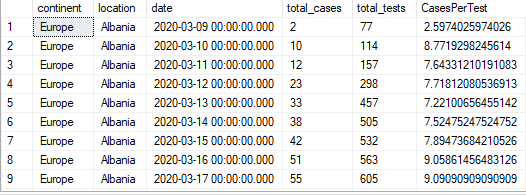

***

### 6. Breaking things down by continent (where North America only includes U.S. Values) and showing continents with the highest death count per population

```sql
SELECT continent, MAX(CAST(total_deaths AS int)) AS TotalDeathCount
FROM PortfolioProject..CovidDeaths
WHERE continent IS NOT NULL
GROUP BY continent
ORDER BY TotalDeathCount DESC
```

Result: 6 rows

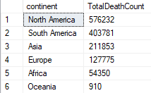

***

### 7. Global numbers: What is the global death percentage grouped by date?

```sql
SELECT date, SUM(new_cases) AS total_cases, SUM(CAST(new_deaths AS int)) AS total_deaths, SUM(CAST(new_deaths AS int))/SUM(new_cases)*100 AS DeathPercentage
FROM PortfolioProject..CovidDeaths
WHERE continent IS NOT NULL
GROUP BY date
ORDER BY 1, 2
```

Result: 486 rows

Here are the last few rows:

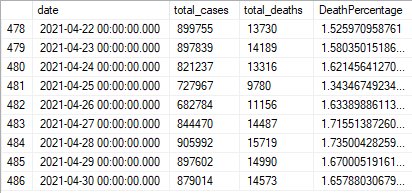

***

### 8. Global numbers: What is the global death percetange?

```sql
SELECT SUM(new_cases) AS total_cases, SUM(CAST(new_deaths AS int)) AS total_deaths, SUM(CAST(new_deaths AS int))/SUM(new_cases)*100 AS DeathPercentage
FROM PortfolioProject..CovidDeaths
WHERE continent IS NOT NULL
ORDER BY 1, 2
```

Result: 1 row

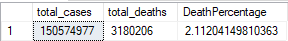


### 9. How many people in the world have been vaccinated (total population vs vaccinated)? 

```sql
SELECT dea.continent, dea.location, dea.date, dea.population, vac.new_vaccinations,
SUM(CAST(vac.new_vaccinations AS int)) OVER(PARTITION BY dea.location ORDER BY dea.location, dea.date) AS RollingPeopleVaccinated
FROM PortfolioProject..CovidDeaths AS dea
JOIN PortfolioProject..CovidVaccinations AS vac
	ON dea.location = vac.location
	AND dea.date = vac.date
WHERE dea.continent IS NOT NULL
ORDER by 2, 3
```

Result: 81,060 rows

Here are the last few rows: 

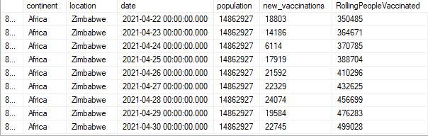

***

### 10. Using above with CTE to help find percent of people vaccinated

```sql
with cte AS(
SELECT dea.continent, dea.location, dea.date, dea.population, vac.new_vaccinations,
SUM(CAST(vac.new_vaccinations AS int)) OVER(PARTITION BY dea.location ORDER BY dea.location, dea.date) AS RollingPeopleVaccinated
FROM PortfolioProject..CovidDeaths AS dea
JOIN PortfolioProject..CovidVaccinations AS vac
	ON dea.location = vac.location
	AND dea.date = vac.date
WHERE dea.continent IS NOT NULL
)

SELECT *, (RollingPeopleVaccinated/cte.population)*100 AS RPV_Percentage
FROM cte
ORDER BY 2, 3
```

Result: 81,060 rows

Here are the last few rows:

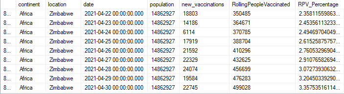

***

### 10a. Turning above into temp table and then creating a view

#### Creating temp table

``` sql
DROP Table if exists #PercentPopulationVaccinated
CREATE Table #PercentPopulationVaccinated
(Continent nvarchar(255),
Location nvarchar(255),
Date datetime,
Population numeric,
New_vaccination numeric,
RollingPeopleVaccinated numeric
)

INSERT into #PercentPopulationVaccinated
SELECT dea.continent, dea.location, dea.date, dea.population, vac.new_vaccinations,
SUM(CAST(vac.new_vaccinations AS int)) OVER(PARTITION BY dea.location ORDER BY dea.location, dea.date) AS RollingPeopleVaccinated
FROM PortfolioProject..CovidDeaths AS dea
JOIN PortfolioProject..CovidVaccinations AS vac
	ON dea.location = vac.location
	AND dea.date = vac.date
WHERE dea.continent IS NOT NULL

SELECT *, (RollingPeopleVaccinated/population)*100 AS RPV_Percentage
FROM #PercentPopulationVaccinated
```

#### Creating view

``` sql
CREATE View PercentPopulationVaccinated AS
SELECT dea.continent, dea.location, dea.date, dea.population, vac.new_vaccinations,
SUM(CAST(vac.new_vaccinations AS int)) OVER(PARTITION BY dea.location ORDER BY dea.location, dea.date) AS RollingPeopleVaccinated
FROM PortfolioProject..CovidDeaths AS dea
JOIN PortfolioProject..CovidVaccinations AS vac
	ON dea.location = vac.location
	AND dea.date = vac.date
where dea.continent IS NOT NULL

SELECT *
FROM PercentPopulationVaccinated
```

***

### 11. What are the max ICU patients by country ordered from highest to lowest?

```sql
SELECT location, MAX(CAST(icu_patients AS int)) AS maxicu
FROM PortfolioProject..CovidDeaths
WHERE continent IS NOT NULL
GROUP BY location
ORDER BY maxicu DESC
```

Result: 210 rows, most of which are null so I will not show them

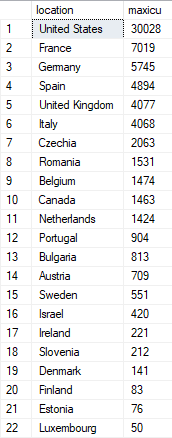

***

### 12. What are the dates with the highest number of ICU patients in the United States?

```sql
SELECT location, date, MAX(CAST(icu_patients AS int)) AS icupatients
FROM PortfolioProject..CovidDeaths
WHERE continent IS NOT NULL
AND location = 'United States'
GROUP BY location, date
ORDER BY icupatients DESC
```

Result: 465 rows

Here are the first 9 rows: 

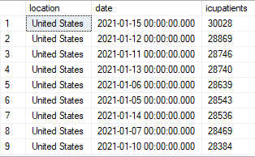

***

### 13. What are the 3 days with the highest number of ICU patients in the United States?

```sql
with cte AS(
SELECT location, date, MAX(CAST(icu_patients AS int)) AS icu_patients2, RANK() OVER(PARTITION BY location ORDER BY MAX(CAST(icu_patients AS int)) DESC) AS rnk
FROM PortfolioProject..CovidDeaths
WHERE continent IS NOT NULL
AND location = 'United States'
GROUP BY location, date
)

SELECT location, date, icu_patients2
FROM cte
WHERE rnk <= 3
```

Result: 3 rows

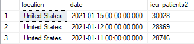

***

### 14. What are the top 3 days with highest number of ICU patients for every country?

```sql
with cte AS(
SELECT location, date, MAX(CAST(icu_patients AS int)) AS icu_patients2, RANK() OVER(PARTITION BY location ORDER BY MAX(CAST(icu_patients AS int)) DESC) AS rnk
FROM PortfolioProject..CovidDeaths
WHERE continent IS NOT NULL
GROUP BY location, date
)

SELECT location, date, icu_patients2
FROM cte
WHERE rnk <= 3 AND icu_patients2 IS NOT NULL
```

Result: 75 rows

Here are the first few rows:

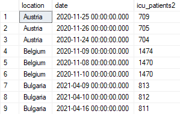

***

### 15. What is the amount of people fully vaccinated in each country?

```sql
SELECT dea.location, dea.population, MAX(CAST(vac.people_fully_vaccinated AS int)) AS fully_vaxxed
FROM PortfolioProject..CovidDeaths dea
JOIN PortfolioProject..CovidVaccinations vac
	ON dea.location = vac.location
	AND dea.date = vac.date
WHERE dea.continent IS NOT NULL
GROUP BY dea.location, dea.population
ORDER BY fully_vaxxed DESC
```

Result: 210 rows

Here are the first few rows:

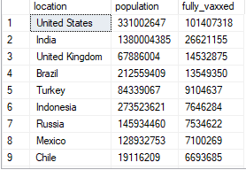

***

### 16. What is the amount of people fully vaccinated in each country expressed as a percentage?

```sql
with cte AS(
SELECT dea.location, dea.population, MAX(CAST(vac.people_fully_vaccinated AS int)) AS fully_vaxxed
FROM PortfolioProject..CovidDeaths dea
JOIN PortfolioProject..CovidVaccinations vac
	ON dea.location = vac.location
	AND dea.date = vac.date
WHERE dea.continent IS NOT NULL
GROUP BY dea.location, dea.population
)

SELECT location, population, fully_vaxxed, (fully_vaxxed/population)*100 AS PercentFullyVaccinated
FROM cte
ORDER BY location
```

Result: 210 rows

Here are the first few rows:

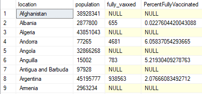

***

### 17. What is the 7 day rolling average of deaths for United States?

```sql
SELECT continent, location, date,  population, CAST(new_deaths AS int) AS new_deaths, AVG(CAST(new_deaths AS int)) OVER(partition BY location ORDER BY location, date rows between 6 preceding and current row) AS WeeklyRollingDeathAverage
FROM PortfolioProject..CovidDeaths
WHERE continent IS NOT NULL AND location = 'United States'
ORDER BY location, date
```

Result: 465 rows

Here are the last few rows:

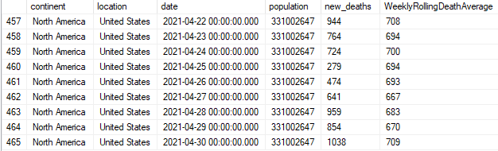

***

### 18. What is the 7 day rolling average of deaths for every location?

```sql
SELECT continent, location, date,  population, CAST(new_deaths AS int) AS new_deaths, AVG(CAST(new_deaths AS int)) OVER(partition BY location ORDER BY location, date rows between 6 preceding and current row) AS WeeklyRollingDeathAverage
FROM PortfolioProject..CovidDeaths
WHERE continent IS NOT NULL
ORDER BY location, date
```

Result: 81,060 rows

Here are some rows looking at Turkey:

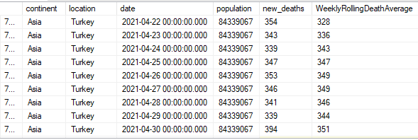

***

### 19. How many people have been vaccinated with one dose? 

```sql
with cte AS(
SELECT dea.continent, dea.location, dea.population, MAX(CAST(vac.people_vaccinated AS int)) AS partially_vaxxed
FROM PortfolioProject..CovidDeaths dea
JOIN PortfolioProject..CovidVaccinations vac
	ON dea.location = vac.location
	AND dea.date = vac.date
--WHERE dea.continent IS NOT NULL
GROUP BY dea.continent, dea.location, dea.population
)

SELECT continent, location, population, partially_vaxxed, (partially_vaxxed/population)*100 AS PercentPartiallyVaccinated
FROM cte
```

Result: 219 rows

Here are rows showing some countries in Asia:

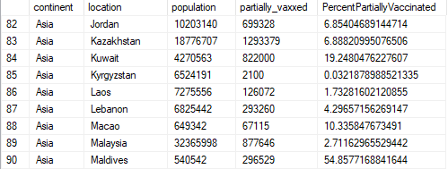

***

### 20. How many people have been vaccinated per hundred?

```sql
SELECT continent, location, MAX(cast(people_vaccinated_per_hundred AS float)) AS Max_People_Vaccinated_Per_Hundred
FROM PortfolioProject..CovidVaccinations
GROUP BY continent, location
ORDER BY location
```

Result: 219 rows

Here are the first few rows:

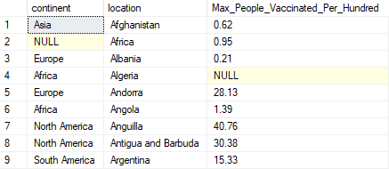

***

### 21. What is a country's GDP per capita and amount of people vaccinated per hundred?

```sql
with cte AS(
SELECT continent, location, MAX(gdp_per_capita) AS Max_GDP_Per_Capita, MAX(cast(people_vaccinated_per_hundred AS float)) AS Max_People_Vaccinated_Per_Hundred 
FROM PortfolioProject..CovidVaccinations
GROUP BY continent, location
)

SELECT *
FROM cte
WHERE Max_GDP_Per_Capita IS NOT NULL
ORDER BY Max_People_Vaccinated_Per_Hundred DESC
```

Result: 190 rows

Here are the first few rows:

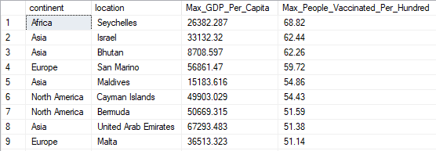
