# 🏠 Nashville Housing Cleaning Project

In this project, we have a data set about housing in Nashville. Let's clean it to make it more usable for data analysis.

Download the original data [here](https://github.com/rb118/PortfolioProject/blob/main/Nashville_Housing_Cleaning_Project/Nashville%20Housing%20Data%20for%20Data%20Cleaning.xlsx).

View the syntax [here](https://github.com/rb118/PortfolioProject/blob/main/Nashville_Housing_Cleaning_Project/NashvilleHousingProject.sql).

***

First, let's take a look at all of our data.

```sql
SELECT *
FROM PortfolioProject.dbo.NashvilleHousing
```

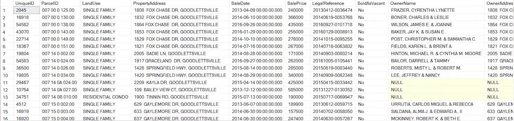

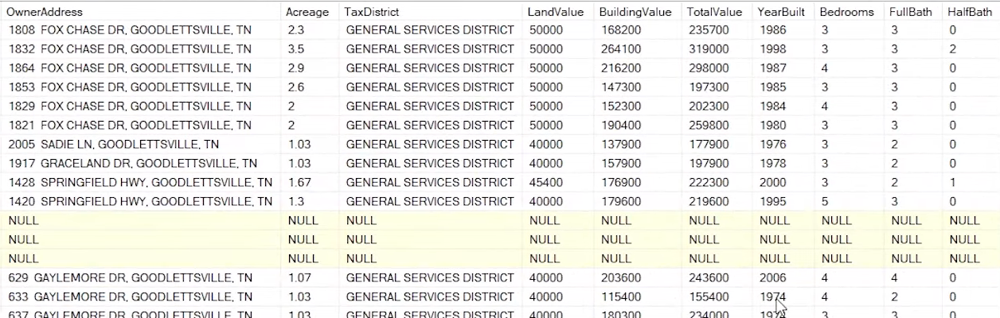

***

## 1. SaleDate Column

The SaleDate column is in DATETIME format. 

```sql
SELECT SaleDate
FROM PortfolioProject.dbo.NashvilleHousing
```

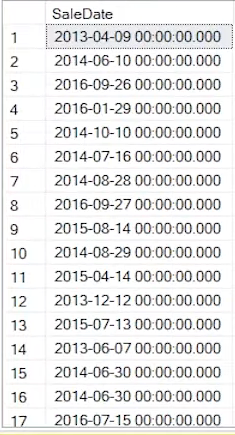

Let's change it so we only get the date (yyyy-mm-dd).

```sql
ALTER TABLE NashvilleHousing
Add SaleDateConverted Date;

UPDATE NashvilleHousing
SET SaleDateConverted = CONVERT(Date, SaleDate)
```

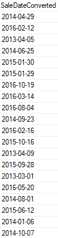

***

## 2. Populate Property Address Data

There are null values in the PropertyAddress column. Since this column is referring to the address of property, we can be almost certain that the values will not change. So, let's find a way to fill these null values.

If we run the following query (where we order by ParcelID), we notice that there are multiple records where ParcelID and PropertyAddress are the same.

```sql
SELECT *
FROM PortfolioProject..NashvilleHousing
ORDER BY ParcelID
```

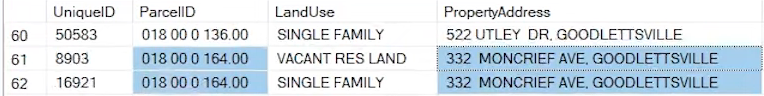

So, we can say if the first ParcelID highlighted has a PropertyAddress, and the second ParcelID does not have a PropertyAddress, let's populate it with the first address that's already populated since we know they are going to be the same.

We can do this by using a self join.

Let's run this query:

```sql
SELECT a.ParcelID, a.PropertyAddress, b.ParcelID, b.PropertyAddress, ISNULL(a.PropertyAddress, b.PropertyAddress)
FROM PortfolioProject..NashvilleHousing a
JOIN PortfolioProject..NashvilleHousing b
	ON a.ParcelID = b.ParcelID
	AND a.[UniqueID ] <> b.[UniqueID ]
WHERE a.PropertyAddress IS NULL
```

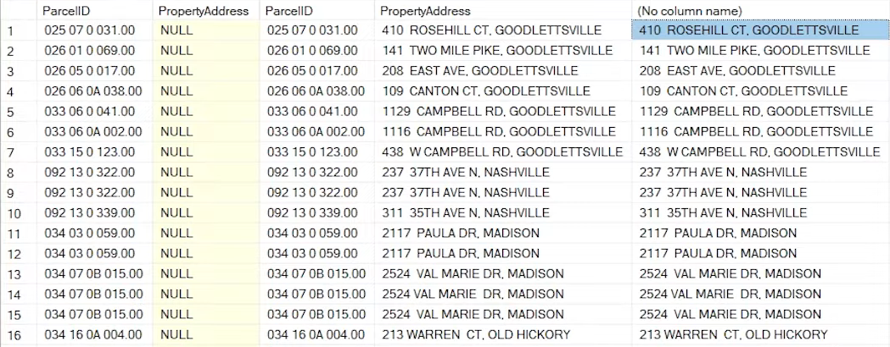

In this query, we use a self join. The first join condition is "WHEN a.ParcelID = b.ParcelID" because in the original data, there are multiple records with the same ParcelID. For the second join condition, we want the results to be when a.UniqueID IS NOT EQUAL to b.UniqueID. Since UniqueIDs are unique, this makes sure that the records we are querying will be different (in terms of UniqueID).

The next important part of this query is using the ISNULL function, which returns a specified value if the expression is NULL. For the above query, we are checking if a.PropertyAddress IS NULL. If it is NULL, then we want to return b.PropertyAddress.

This whole query creates a column that we will use to UPDATE the PropertyAddress column.

```sql
UPDATE a
SET PropertyAddress = ISNULL(a.PropertyAddress, b.PropertyAddress)
FROM PortfolioProject..NashvilleHousing a
JOIN PortfolioProject..NashvilleHousing b
	ON a.ParcelID = b.ParcelID
	AND a.[UniqueID ] <> b.[UniqueID ]
WHERE a.PropertyAddress IS NULL
```

The above UPDATE query will successfully populate the PropertyAddress column.

***

## 3a. Separating Address into Individual Columns (Address, City, State)

Let's look at the PropertyAddress column.

```sql
SELECT PropertyAddress
FROM PortfolioProject..NashvilleHousing
```

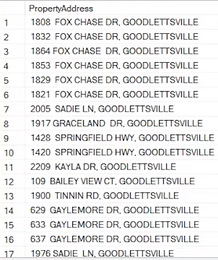

This column has the address followed by the city. Let's clean this data by separating the address from the city. 

Note that the data in this column is separated by a comma. We will use this to separate the column into two different ones. The following query will separate PropertyAddress into two columns: one for the address and the other for the city.

```sql
SELECT 
	SUBSTRING(PropertyAddress, 1, CHARINDEX(',', PropertyAddress) -1) AS Address,
	SUBSTRING(PropertyAddress, CHARINDEX(',', PropertyAddress) +2, LEN(PropertyAddress)) AS Address
FROM PortfolioProject..NashvilleHousing
```

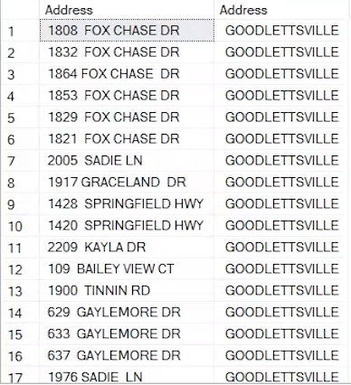

To separate PropertyAddress into just the address, we used the SUBSTRING and CHARINDEX functions to get the data of each record BEFORE the comma. We used "-1" because we do not want the comma in the new column we are making.

To separate PropertyAddress into the city, we will use the same functions as before in addition to the LEN function. Firstly, our starting posititon (as per the syntax for the SUBSTRING function) is the index of the comma +2. The +2 will give us the start of the name of the city with no space or comma preceding it. We use LEN(PropertyAddress) as the last part of the SUBSTRING syntax to return the rest of the data in that record.

Now let's update our data.

Making the first column, PropertySplitAddress:

```sql
ALTER TABLE PortfolioProject.dbo.NashvilleHousing
ADD PropertySplitAddress Nvarchar(255);

UPDATE PortfolioProject.dbo.NashvilleHousing
SET PropertySplitAddress = SUBSTRING(PropertyAddress, 1, CHARINDEX(',', PropertyAddress) -1)
```

Making the second column, PropertySplitCity:

```sql
ALTER TABLE PortfolioProject.dbo.NashvilleHousing
ADD PropertySplitCity Nvarchar(255);

UPDATE PortfolioProject.dbo.NashvilleHousing
SET PropertySplitCity = SUBSTRING(PropertyAddress, CHARINDEX(',', PropertyAddress) +2, LEN(PropertyAddress))
```

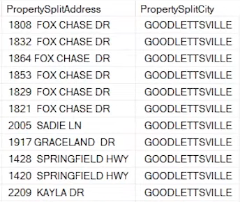

## 3b. We can do the same thing in a different and simpler way. Let's look at the OwnerAddress column this time. 

```sql
SELECT OwnerAddress
FROM PortfolioProject.dbo.NashvilleHousing
```

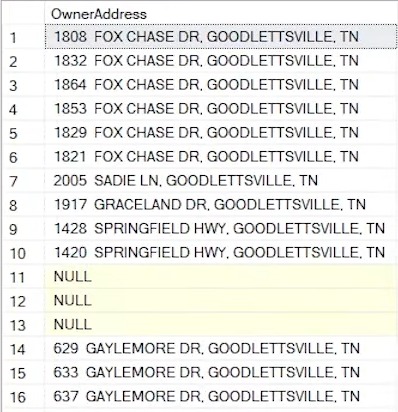

Here we have the address, city, and state. We want to split this into three different columns. We will use PARSENAME to do this.

```sql
SELECT
	PARSENAME(REPLACE(OwnerAddress, ',', '.'), 3),
	PARSENAME(REPLACE(OwnerAddress, ',', '.'), 2),
	PARSENAME(REPLACE(OwnerAddress, ',', '.'), 1)
FROM PortfolioProject.dbo.NashvilleHousing
```

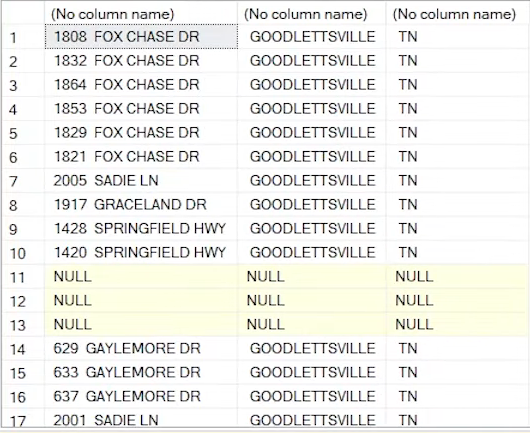

PARSENAME looks for periods, and OwnerAddress is separated by commas. So, we used the REPLACE function to replace the commas with periods.

In the original column OwnerAddress, the order of each record is address then city followed by state. For the three times we used PARSENAME, we ended the syntax with 3, then 2, then 1, respectively. If we had done 1 then 2 then 3, our resulting data would be 3 columns in the order of state, city, then address. So, if we use 3 in the PARSENAME syntax, we will actually get the first part of the OwnerAddress data, which is the address (2 would be city and 1 would be the state).

Now let's update our data.

Owner's address:

```sql
ALTER TABLE PortfolioProject.dbo.NashvilleHousing
Add OwnerSplitAddress Nvarchar(255);

UPDATE PortfolioProject.dbo.NashvilleHousing
SET OwnerSplitAddress = PARSENAME(REPLACE(OwnerAddress, ',', '.'), 3)
```

Owner's city:

```sql
ALTER TABLE PortfolioProject.dbo.NashvilleHousing
Add OwnerSplitCity Nvarchar(255);

UPDATE PortfolioProject.dbo.NashvilleHousing
SET OwnerSplitCity = PARSENAME(REPLACE(OwnerAddress, ',', '.'), 2)
```

Owner's state:

```sql
ALTER TABLE PortfolioProject.dbo.NashvilleHousing
Add OwnerSplitState Nvarchar(255);

UPDATE PortfolioProject.dbo.NashvilleHousing
SET OwnerSplitState = PARSENAME(REPLACE(OwnerAddress, ',', '.'), 1)
```

Now, if we look at all our data for the NashvilleHousing table, we will have three new columns.

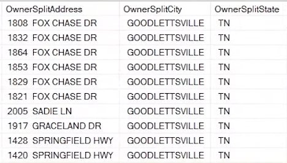

***

## 4. Change "Y" and "N" to "Yes" and "No" in "Sold as Vacant" column

In our SoldAsVacant column, we have four different results: "Y", "N", "Yes", or "No". Let's change this column so that "Y" becomes "Yes" and "N" becomes "No."

```sql
SELECT DISTINCT(SoldAsVacant), COUNT(SoldAsVacant)
FROM PortfolioProject.dbo.NashvilleHousing
GROUP BY SoldAsVacant
ORDER BY 2
```

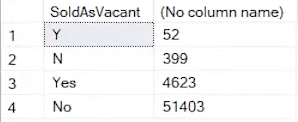

This query gives us two columns: the first is the distinct values in the SoldAsVacant column, and the second is the number of records of each distinct value.

Here is the query that will show us the original SoldAsVacant column, and the new SoldAsVacant (which we will use in an update statement soon):

```sql
SELECT SoldAsVacant,
	CASE WHEN SoldAsVacant = 'Y' THEN 'Yes'
		 WHEN SoldAsVacant = 'N' THEN 'No'
		 ELSE SoldAsVacant
		 END
FROM PortfolioProject.dbo.NashvilleHousing
```

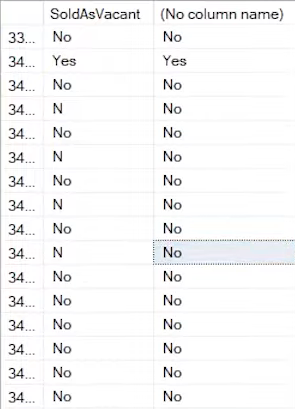

Note in the second column that "N" has become "No."

Now let's update our data.

```sql
UPDATE PortfolioProject.dbo.NashvilleHousing
SET SoldAsVacant = CASE WHEN SoldAsVacant = 'Y' THEN 'Yes'
		 WHEN SoldAsVacant = 'N' THEN 'No'
		 ELSE SoldAsVacant
		 END
```

If we run the first query we made for this question that counts the distinct values, we will see that our update worked.

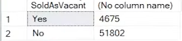

***

## 5. Remove duplicates

To remove duplicates for this data set, we can use PARTITION BY and select some columns that, when combined in a partition, will be more or less a distinct value. 

```sql
with RowCTE AS(
SELECT *,
	ROW_NUMBER() OVER (
	PARTITION BY ParcelID,
		     PropertyAddress,
		     SalePrice,
		     SaleDate,
		     LegalReference
		     ORDER BY UniqueID
				 ) rn
FROM PortfolioProject.dbo.NashvilleHousing
)

DELETE
FROM RowCte
WHERE rn > 1
```

This query will partition our data by the columns ParcelID, PropertyAddress, SalePrice, SaleDate, and LegalReference. Since we are using the ROW_NUMBER function, each row where these values are unique will have a ROW_NUMBER value of 1. If there is more than one row where those values are repeated, the value of that ROW_NUMBER will be more than 1, which means we will have a duplicate row. We can use DELETE to get rid of values where ROW_NUMBER is greater than 1.

***

## 6. Delete unused columns

```sql
ALTER TABLE PortfolioProject.dbo.NashvilleHousing
DROP COLUMN OwnerAddress, PropertyAddress, SaleDate
```

This query gets rid of columns that we no longer need since we have updated columns for each.

***


